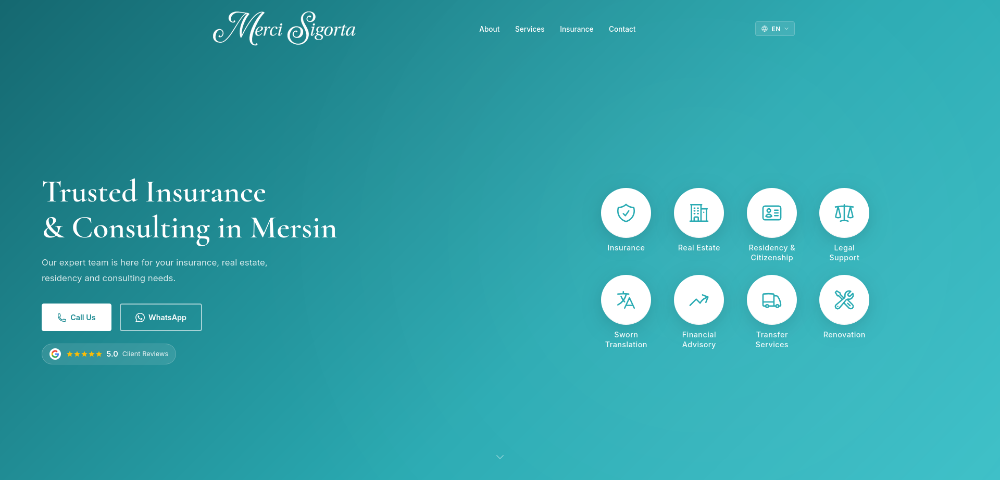

# Merci Insurance & Consultancy

The corporate website for Merci Sigorta & Consultancy. Built with [Eleventy](https://www.11ty.dev/) v3, this is a static and multilingual project. 
Live site: [www.mercisigorta.com](https://www.mercisigorta.com)



## Features & Technologies
- **Multilingual:** English, Turkish, and Russian with automatic language detection.
- **Tech Stack:** Eleventy v3 (SSG), Nunjucks, and raw CSS/JS.
- **Performance:** Highly optimized with minified assets, responsive images (AVIF/WebP), and comprehensive SEO setup.
- **Data Integration:** Statically fetches Google Business reviews at build-time.
- **Deployment:** Hosted on GitHub Pages, built weekly via GitHub Actions.

## Getting Started

**Requirements:** Node.js v18+

```bash
# Clone the repository
git clone https://github.com/slmnkara/merci-sigorta.git
cd merci-sigorta

# Install dependencies
npm install

# Start development server (localhost:8080)
npm run dev

# Build for production (outputs to docs/)
npm run build
```

**Environment Variables:**
Create a `.env` file for Google Business integration:
```env
GOOGLE_API_KEY="your_api_key"
GOOGLE_PLACE_ID="your_place_id"
```

## License
Proprietary software. All rights reserved. See the [LICENSE](LICENSE) file for more details.
